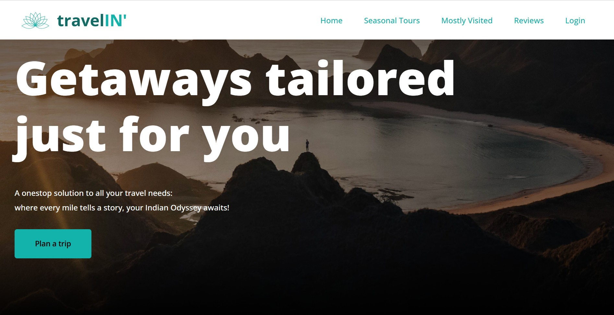
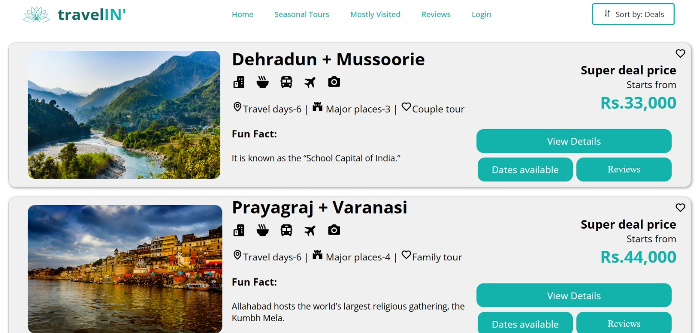

# 🌍 TravelIN’ - Smart Travel Planning Website ✈️  

## About TravelIN’  
TravelIN’ is a smart travel planning website that provides personalized itineraries and recommendations for travelers. The platform helps users discover exciting destinations, plan their trips seamlessly, and make the most of their travel experiences. 🏝️ 



## Features  
- 📅 Personalized travel itineraries based on user preferences  
- 🍽️ Recommendations for places to visit, restaurants, and activities  
- 🖥️ Intuitive and user-friendly interface for easy trip planning  
- 📱 Responsive design for a smooth experience across devices
  



## Technologies Used  
- **HTML** - Structure and content of the website  
- **CSS** - Styling and layout design 🎨  
- **JavaScript** - Dynamic content and interactive features ⚡  

## Installation & Usage  
1. Clone the repository:  
   ```bash
   git clone https://github.com/cherrychhallani/travelIN.git
   ```  
2. Open the project folder and launch `index.html` in a browser.  

## Contact  
For any inquiries or suggestions, feel free to reach out via email at [cherrychhallani11@gmail.com] 📩  
